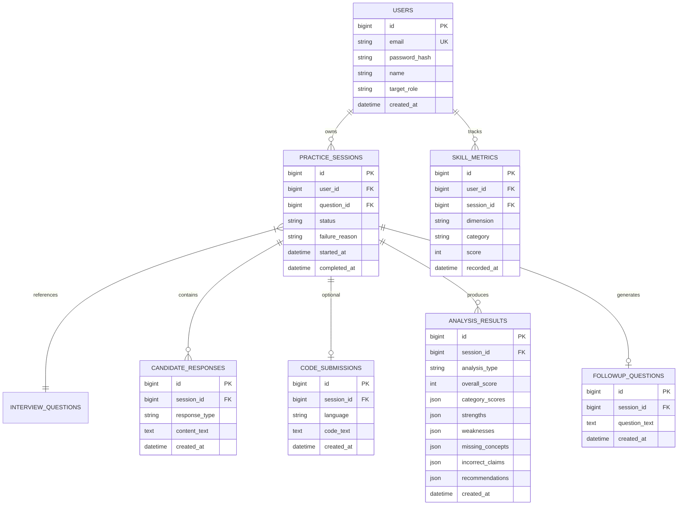

# Entity-Relationship (ER) Diagram — Technical Interview Reasoning Coach

```mermaid
erDiagram
    USERS ||--o{ PRACTICE_SESSIONS : "owns"
    USERS ||--o{ SKILL_METRICS : "tracks"
    PRACTICE_SESSIONS }|--|| INTERVIEW_QUESTIONS : "references"
    PRACTICE_SESSIONS ||--o{ CANDIDATE_RESPONSES : "contains"
    PRACTICE_SESSIONS ||--o| CODE_SUBMISSIONS : "optional"
    PRACTICE_SESSIONS ||--o{ ANALYSIS_RESULTS : "produces"
    PRACTICE_SESSIONS ||--o| FOLLOWUP_QUESTIONS : "generates"

    USERS {
        bigint id PK
        string email UK
        string password_hash
        string name
        string target_role
        datetime created_at
    }

    PRACTICE_SESSIONS {
        bigint id PK
        bigint user_id FK
        bigint question_id FK
        string status
        string failure_reason
        datetime started_at
        datetime completed_at
    }

    CANDIDATE_RESPONSES {
        bigint id PK
        bigint session_id FK
        string response_type
        text content_text
        datetime created_at
    }

    CODE_SUBMISSIONS {
        bigint id PK
        bigint session_id FK
        string language
        text code_text
        datetime created_at
    }

    ANALYSIS_RESULTS {
        bigint id PK
        bigint session_id FK
        string analysis_type
        int overall_score
        json category_scores
        json strengths
        json weaknesses
        json missing_concepts
        json incorrect_claims
        json recommendations
        datetime created_at
    }

    FOLLOWUP_QUESTIONS {
        bigint id PK
        bigint session_id FK
        text question_text
        datetime created_at
    }

    SKILL_METRICS {
        bigint id PK
        bigint user_id FK
        bigint session_id FK
        string dimension
        string category
        int score
        datetime recorded_at
    }
```
